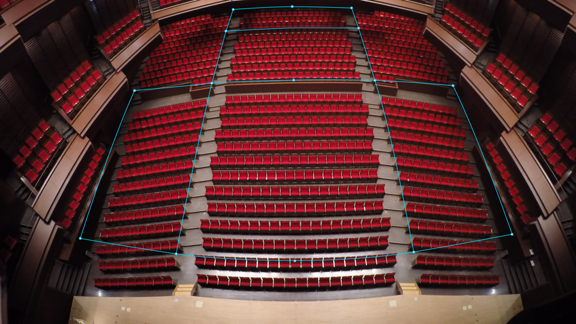
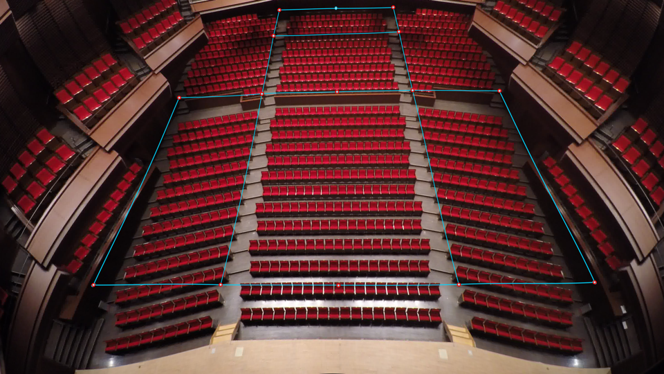
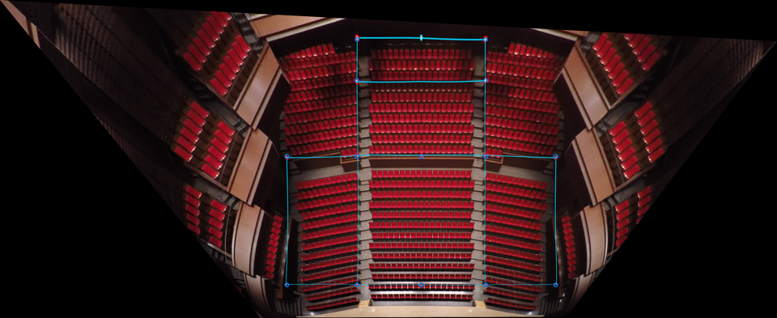

LensCalibrator
========================

__LensCalibrator__ converts coordinates in a picture to the real world based on multiple reference points in the picture.

Requirements
------------------------

- Python 3.x
- modules
    - see [requirements.txt](requirements.txt)


Sample
------------------------

|                | Image |
|----------------|-------|
| original image |  |
| undistorted    |  |
| undistorted + projected |  |

Usage
------------------------

See `--help`.

```sh
$ ./calibrate.py --help
usage: calibrate.py [-h] [--version] [-t] [-v] [--out FILE]
                    [--size WIDTH HEIGHT] [-z Z]
                    [FILE]

Calibrate coordinates in picture to real world.

positional arguments:
  FILE                 path to source file

optional arguments:
  -h, --help           show this help message and exit
  --version            show program's version number and exit
  -t, --test           test the program
  -v, --verbose        display debug info to standard output (default: False)

output options:
  --out FILE           set path to output file (default: display to standard
                       output)

format options:
  --size WIDTH HEIGHT  set dimension of the image (default: (3840, 2160))
  -z Z                 z-axis in destination points to obtain (default: None)
```


Location file format
------------------------

- The file name must be `Location.csv`.
- comma-separated, LF line endings
- Each line describes the relationship between a reference point in the picture and the real world. The first three columns represent x,y,z coordinates in the real world in mm, and the remaining two columns represent x,y coordinates in the picture in pixel.
- See file at `test/Location.csv` for example.
